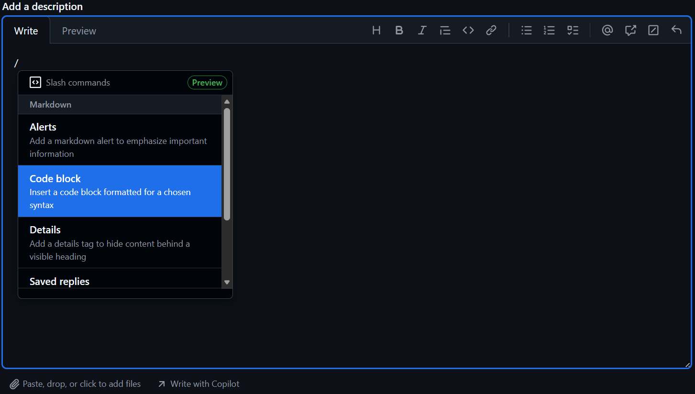

<!-- README.md is generated from README.Rmd. Please edit that file -->

```{r, include = FALSE}
knitr::opts_chunk$set(
  collapse = TRUE,
  comment = "#>",
  fig.path = "man/figures/README-",
  out.width = "100%"
)
```

# WAVES

Thank you for your collaboration in the Wrist Algorithm Verification and Evaluation Study (WAVES). This repository contains all the code needed to run multiple wrist algorithms against your raw data.

## Proposed Flow Diagram

The proposed flow diagram outlines the process for how the validation data and data pipeline will work with the WAVES team and groups who have potentially available validation data.


**Full description of the flow diagram coming soon** \## Setup

1.  Install R

    1.  From [this link](https://cran.r-project.org/mirrors.html), click on the mirror from the location closest to you.

    2.  On the following page, download and install R for your operating system. So far, only Windows and macOS have been tested.

    3.  The code has been tested on v4.4.1 and v4.5.2. We recommend the latest v4.5.2. but earlier versions down to 4.4.0 should work. Just note you will get warning messages that the packages were developed for 4.5.2.

2.  Install RStudio

    1.  From [this link](https://posit.co/download/rstudio-desktop/), click on the "DOWNLOAD RSTUDIO DESKTOP FOR WINDOWS/MACOS"
    2.  A version from 2023 onwards should be okay.

3.  Install RTools

    1.  From [this link](https://cran.r-project.org/bin/windows/Rtools/), download the RTools version specific to the R version being used (i.e. Rtools 4.4 for R v4.4.1, RTools 4.5 for R v4.5.2)

4.  Download WAVES repository.

    1.  The location of the WAVES repository can be downloaded anywhere on your system, but it is generally recommended to keep it on the same drive of the raw accelerometer data.

## Instructions

### Configuration Pipeline

1.  Open WAVES.RProj

    1.  This will automatically open the RStudio IDE.

2.  In Console, run `renv::restore()`

    1.  This command will download all the R software packages needed for the WAVES repository. It will take a while.

3.  Open "\_targets_config.R"

    1.  Navigate to the "Files" tab within Rstudio (located either in the bottom left or top left pane of the RStudio window IF you haven't changed the pane layout in "Global Settings"). Click on "\_targets*\_*config.R"

    2.  Alternatively, open "\_targets*\_*config.R" with the system File Explorer. It should open the script within RStudio.

4.  Within "INPUT" section, check the following:

    1.  `RETICULATE_MINICONDA_PATH`: The path to an existing conda installation or where you want a new minconda distribution to be installed.
        1.  If this is changed, please ensure there are no spaces within the file path
        2.  Note that if the WAVES directory is located under another directory with the names `bash`, `data`, `logs`, `media`, `models`, `quarto`, `R`, `renv` or `reports`, the config pipeline will install miniconda underneath the corresponding folder *in the WAVES directory*.
            1.  For example, if the WAVES directory was installed under "/data/martinez/", then miniconda will be installed in "/data/martinez/WAVES/data/martinez/r-miniconda"
    2.  `n_workers`: The default is 2 workers, meaning 2 processes of the pipeline will run in parallel of each other.
        1.  `n_workers` should always be at least 2!
        2.  If your operating system has more RAM and cores available, feel free to increase the number of workers, with the max being one less than the number of cores available of your system (`future::availableCores() - 1`)

5.  Run all code within the "INPUT" section (Line 8 - Line 26) and save the script.

6.  In Console, run `tar_make().`The "configuration" pipeline is now running, which will print messages out in the Console like the below image.

    

    The "configuration" pipeline is:

    1.  Downloading and installing non-R software

    2.  Running the code against "configuration" data included within the WAVES repository to ensure code is running properly

    3.  This will take awhile! On a potato computer, it took 15-24 hours!

    4.  If the repository is being ran on a local computer, it is almost mandatory that no other work be done while the pipeline is running.

7.  Once the pipeline is complete the console should say "ended pipeline" with how long it took.

    

    Or it may error like so:

    

    At least `config_miniconda` should be completed, allowing you to move on to step 8.

8.  A "summary_miniconda.html" will have been created under the "reports" folder of the main WAVES repository. Within the html file:

    1.  Check Miniconda configuration is good, where status is not "Unsuccessful installation".

    2.  No packages/modules are highlighted red for each environment.

        1.  For a environment, the Modules message may say "Modules installated do not completely match WAVES configuration". This is expected with slight changes in package/module versions within each environment, and are highlighted yellow. This shouldn't impact pipeline processes or computations, but are still noted to assist with diagnosing potential problems.

9.  If the config pipeline errored, please post on issue on Github following the convention set forth under [Posting an Issue on GitHub] section of the README.

10. If the pipeline successfully completed, a "summary_pipeline_config.html" file will have been created under the "reports" folder of the main WAVES repository. Open the file and follow the directions stated within the report.

11. If the "summary_pipeline_config.html" indicates no warnings or errors, then the WAVES code is working properly on your computer! Woo.

12. If the "summary_pipeline_config" report is red for any reason, please post the issue with the title as "Config - Summary Report - [Quick Description]" with the html attached to the issue.

### Main Pipeline

1.  Open "\_targets.R"

    1.  Navigate to the "Files" tab within Rstudio (located either in the bottom left or top left pane of the RStudio window IF you haven't changed the pane layout in "Global Settings"). Click on "\_targets.R"

    2.  Alternatively, open "\_targets.R" with the system File Explorer. It should open the script within RStudio.

2.  Within "INPUT" section, check the following:

    1.  `RETICULATE_MINICONDA_PATH`: The path to the conda installation specified within the configuration pipeline.
    2.  `study_timezone`: Change from `Sys.timezone()` if data was collected in another timezone. Supply it as country/city (e.g. `America/Los Angeles`, `Europe/London`, etc.)
    3.  `sampling_frequency`: The sampling frequency set for accelerometers during data collection. If using .bin/.cwa/.gt3x data then this doesn't matter, but does for .csv data.
    4.  `n_workers`: The default is 2 workers, meaning 2 processes of the pipeline will run in parallel of each other.
        1.  `n_workers` should always be at least 2!
        2.  If your operating system has more RAM and cores available, feel free to increase the number of workers, with the max being one less than the number of cores available of your system (`future::availableCores() - 1`)
    5.  `vct_raw_fpa`: Change vct_raw_fpa such that it creates a character vector that points towards your raw files.
        1.  We provide an example of how to do so using the `list.files` function, where the `file.path` function is used to list multiple directories at once.
        2.  We suggest putting a "[1]" at the end of `list.files` to make sure pipeline works with one file. (image below)

    

3.  Save the "\_targets.R" script.

4.  Run the code within "INPUT" section.

5.  In Console, run "tar_make()". For one file that is a whole day, it can take anywhere between 15-30 minutes on a potato computer. For one file that is a whole week, it may take up to 24 hours.

6.  Once the pipeline has completed, a .html file should have been created under the "reports" folder called "summary_pipeline_main.html". Open the file and double-check file went through entire pipeline successfully under the "By Major Steps" section.

7.  If pipeline works successfully, close the "summary_pipeline_main.html" file and run pipeline on all files available by removing the the "[1]" at the end of the `list.files` function.

    1.  Make sure to save the "\_targets.R" script and rerun the code within "INPUT" section.

    2.  This WILL take multiple days if the repository is not being ran on a high performance cluster.

    3.  If the repository is being ran on a local computer, it is almost mandatory that no other work be done while the pipeline is running.

        1.  If the pipeline is interrupted due to an unexpected restart, the progress should be saved for major steps within the pipeline. Re-follow steps 12-13 the pipeline will pick up from the last major step.

8.  Open "summary_pipeline_main.html" once again and check to see what files have made it through. If all files have made it through, or at least the file's you would've expected to be successfully processed, share the "3_MERGED" folder with WAVES data team, where "3_MERGED" is renamed with the study acronym.

## Notes

-   Even if a pipeline finishes successfully, you may see in the console "There were XX warnings (use warnings() to see them)". This is normal if working on an R version that is not 4.5.2., as the messages will be warnings that the packages are meant to work on the latest R version. As long as the R version being used is R 4.4 or beyond, everything should still work. We have not tested the WAVES repository on R versions below 4.4.

-   If working on a high performance cluster...TODO (work with Hayden, Ben on swarm and batch scripts)

-   If the pipeline appears "stuck" after 24hrs, as in it looks like there has been no change in the processing time or the console messages have been the same for quite awhile, its most likely that your computer does not have enough computing resources to do parallel processing. In that case:

    -   Stop the pipeline by clicking the "STOP" button that appears in the top right corner of the Console pane.

    

    -   Change the `n_workers` object to 1, which will remove parallel processing.

## Posting an Issue on GitHub

After navigating to the Issues tab of WAVES, please use the following naming convention for the title of the issue:

```         
[Pipeline] - [Target/Report] - [Quick Description]
```

where:

-   Pipeline: `Config` or `Main`

    -   If the error occurred while running the `Config` pipeline or `Main` pipeline.

-   Target/Report: any of the targets within a pipeline or a report such as `summary_pipeline_main` or `summary_miniconda`

    -   A "target" is another name for a step within the pipeline.

    -   The target that errored is usually what appears after an ❌. So in Step 7 of the Configuration pipeline instructions, the target was `fpa_merged`

    -   The following is a list of targets within the pipelines where errors may occur:

        -   vct_raw

        -   vct_raw_type

        -   vct_basic

        -   lst_out.cut

        -   vct_ox_input

        -   vct_ox_step

        -   vct_ox_wlms

        -   vct_ox_acti

        -   lst_ox

        -   vct_cal

        -   lst_out.raw

        -   lst_out.oak.pre

        -   fpa_merged

        -   pipeline_summary

    -   The below only appear within the `config` pipeline:

        -   lst_miniconda

        -   minconda_summary

-   Quick Description: The error itself if it is ≤ 10 words or a summary

Within the description of the issue, please either:

-   screenshot your console that includes the pipeline output and the error itself (example below)


-   Copy the output from the console into a codeblock

    -   With the description box highlighted, enter a forward slash `/` and then select "Code Block"

    

    -   For language, select "R"

    -   Within the code block, paste the console output

Additionally, if the error occured at `lst_out.raw` , `vct_ox_step` , `vct_ox_wlms` , `vct_ox_acti` `lst_out.raw` or `lst_out.oak.pre` , then please also attach the "summary_miniconda.html" report.

## Methods Implemented

| Method | MVPA | SED | Steps |
|------------------|------------------|------------------|------------------|
| Bakrania 2016[@bakrania2016] | ❌ | ✔️ | ❌ |
| Ellis 2016[@ellis2016] Extended | ✔️️ | ✔️ | ❌ |
| Esliger 2011[@esliger2011] | ✔️ | ✔️ | ❌ |
| Fraysse 2020[@fraysse2021] | ✔️ | ✔️ | ❌ |
| Hildebrand 2014[@hildebrand2014]/2017[@hildebrand2017] | ✔️ | ✔️ | ❌ |
| Mielke 2023[@mielke2023] | ✔️ | ✔️ | ❌ |
| Montoye 2018[@montoye2018] | ✔️ | ✔️ | ❌ |
| Trost 2017[@pavey2017] Extended | ✔️ | ✔️ | ❌ |
| Walmsley 2022[@walmsley2022] (accelerometer v7.3.0[@doherty2025]) | ✔️ | ✔️ | ❌ |
| White 2016[@white2016] ENMO and HPFVM | ✔️ | ✔️ | ❌ |
| Yuan 2024[@yuan2024] (actinet) | ✔️ | ✔️ | ❌ |
| Oak[@straczkiewicz2023] | ❌ | ❌ | ✔️ |
| Small 2024[@small2024] (stepcount v3.17.1[@chan2026]) | ❌ | ❌ | ✔️ |
| Step Detection Threshold[@ducharme2021] (SDT) | ❌ | ❌ | ✔️ |
| Verisense (Original)[@gu2017] | ❌ | ❌ | ✔️ |
| Verisense (Revised)[@maylor2022] | ❌ | ❌ | ✔️ |

## TODO

-   Test WAVES_10006 CSV file against OxWearable methods.

    -   Stepcount
    -   Walmsley
    -   Actinet

## References for Methods
