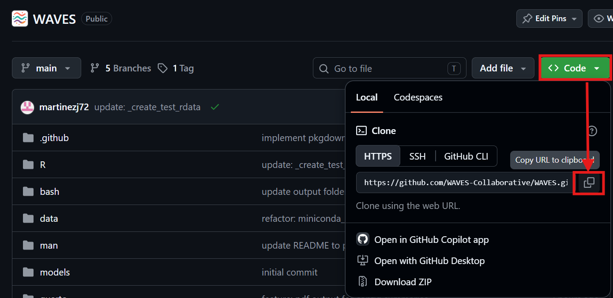

<!-- README.md is generated from README.Rmd. Please edit that file -->

```{r, include = FALSE}
knitr::opts_chunk$set(
  collapse = TRUE,
  comment = "#>",
  fig.path = "man/figures/README-",
  out.width = "100%"
)
```

# WAVES

Thank you for your collaboration in the Wrist Algorithm Verification and Evaluation Study (WAVES). This repository contains all the code needed to run multiple wrist algorithms against your raw data.

## Proposed Flow Diagram

The proposed flow diagram outlines the process for how the validation data and data pipeline will work with the WAVES team and groups who have potentially available validation data.


**Full description of the flow diagram coming soon**

## Preliminary Setup

For the following steps, administrator access should not be needed.

1.  Install R

    1.  From this [CRAN mirrors webpage](https://cran.r-project.org/mirrors.html), click on the mirror from the location closest to you.

    2.  On the following page, download and install R for your operating system. So far, only Windows and macOS have been tested.

    3.  The code has been tested on v4.4.1 and v4.5.2. We recommend the latest v4.5.2. but earlier versions down to 4.4.0 should work. Just note you will get warning messages that the packages were developed for 4.5.2.

2.  Install RStudio

    1.  From this [POSIT RStudio webpage](https://posit.co/download/rstudio-desktop/), click on the "DOWNLOAD RSTUDIO DESKTOP FOR WINDOWS/MACOS"
    2.  A version from 2023 onwards should be okay.

3.  Install compilation tools (platform-specific)

    **Windows:**

    1.  From the [CRAN RTools webpage](https://cran.r-project.org/bin/windows/Rtools/), download the RTools version specific to the R version being used (i.e. Rtools 4.4 for R v4.4.1, RTools 4.5 for R v4.5.2)

    **macOS:**

    Several R packages need to be compiled from source. Install the following dependencies via [Homebrew](https://brew.sh/) by running the following command within the system shell (Terminal):

    ```         
    brew install cmake gcc gettext
    ```

    Then create `~/.R/Makevars` so R can find the installed libraries by running the following code within the system shell (Terminal):

    ```         
    mkdir -p ~/.R
    cat > ~/.R/Makevars << 'EOF'
    CPPFLAGS += -I/opt/homebrew/opt/gettext/include
    LDFLAGS += -L/opt/homebrew/opt/gettext/lib -lintl -L/opt/homebrew/opt/gcc/lib/gcc/current
    FLIBS = -L/opt/homebrew/opt/gcc/lib/gcc/current -lgfortran -lquadmath
    FC = /opt/homebrew/bin/gfortran
    F77 = /opt/homebrew/bin/gfortran
    EOF
    ```

    Additionally, the `arrow` R package requires setting an environment variable before running `renv::restore()`. Run the following within the system shell (Terminal):

    ```         
    export LIBARROW_BINARY=true
    ```

    This tells the package to download a pre-built Arrow C++ library instead of compiling against the system version.

4.  Install Git by going to [git install webpage](https://git-scm.com/install/). There, select your operating system and follow the instructions on the webpage.

    a.  In the git setup wizard, select all the default options.

5.  Open the RStudio application. In the Navigation bar at the top left corner, click File -\> New Project...

    

6.  In the New Project wizard pop-up, click "Version Control".

    

7.  Then, click "Git".

    

8.  Go to the WAVES github page, Click on the green "Code" button, and click the "Copy to Clipboard" button.

    

9.  Go back to the RStudio New Project pop-up and paste the WAVES Github link in the Repository URL section. The "Project directory name" will automatically appear as WAVES.

    

10. Choose location of WAVES repository in the "Create project as subdirectory of" section.

    a.  The location of the WAVES repository can generally be downloaded anywhere on your system. However, it is ***HIGHLY*** recommended to:
        i.  Download the repository on a mapped network drive or on the actual computer system itself, ***NOT*** on the cloud such as OneDrive.
        ii. Not save it directly under a directory with the following names: `bash`, `data`, `logs`, `media`, `models`, `quarto`, `R`, `renv` or `reports.`
        iii. Keep it on the same drive where the raw accelerometer data is located.

11. Click the "Create Project" button.

## Methods Implemented

| Method | MVPA | SED | Steps |
|------------------|------------------|------------------|------------------|
| Bakrania 2016[@bakrania2016] | ❌ | ✔️ | ❌ |
| Ellis 2016[@ellis2016] Extended | ✔️️ | ✔️ | ❌ |
| Esliger 2011[@esliger2011] | ✔️ | ✔️ | ❌ |
| Fraysse 2020[@fraysse2021] | ✔️ | ✔️ | ❌ |
| Hildebrand 2014[@hildebrand2014]/2017[@hildebrand2017] | ✔️ | ✔️ | ❌ |
| Mielke 2023[@mielke2023] | ✔️ | ✔️ | ❌ |
| Montoye 2018[@montoye2018] | ✔️ | ✔️ | ❌ |
| Trost 2017[@pavey2017] Extended | ✔️ | ✔️ | ❌ |
| Walmsley 2022[@walmsley2022] (accelerometer v7.3.0[@doherty2025]) | ✔️ | ✔️ | ❌ |
| White 2016[@white2016] ENMO and HPFVM | ✔️ | ✔️ | ❌ |
| Yuan 2024[@yuan2024] (actinet) | ✔️ | ✔️ | ❌ |
| Oak[@straczkiewicz2023] | ❌ | ❌ | ✔️ |
| Small 2024[@small2024] (stepcount v3.17.1[@chan2026]) | ❌ | ❌ | ✔️ |
| Step Detection Threshold[@ducharme2021] (SDT) | ❌ | ❌ | ✔️ |
| Verisense (Original)[@gu2017] | ❌ | ❌ | ✔️ |
| Verisense (Revised)[@maylor2022] | ❌ | ❌ | ✔️ |

## TODO

- Test WAVES_10006 CSV file against OxWearable methods.

  - Stepcount
  - Walmsley
  - Actinet

## References for Methods
