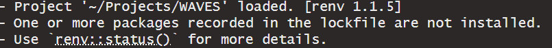
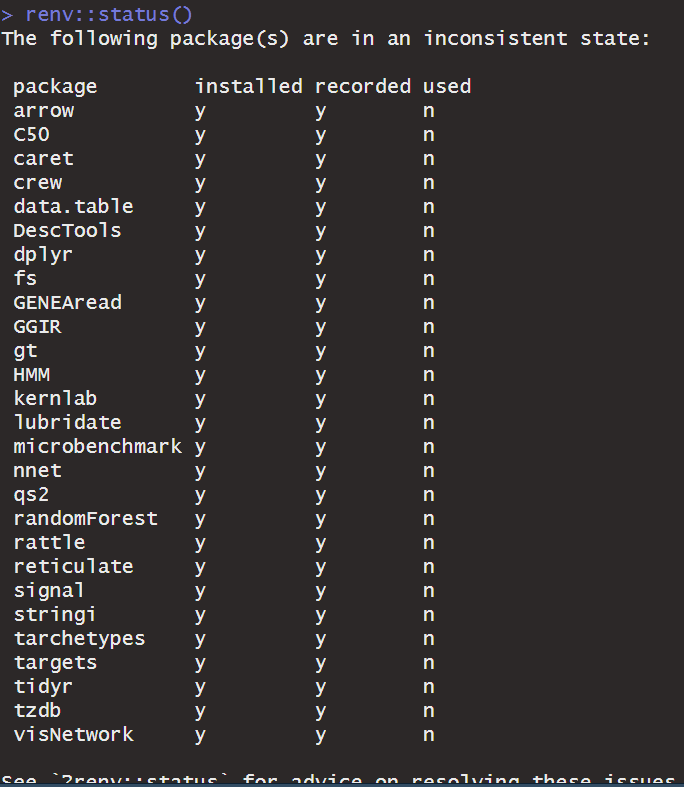

<!-- README.md is generated from README.Rmd. Please edit that file -->

```{r, include = FALSE}
knitr::opts_chunk$set(
  collapse = TRUE,
  comment = "#>",
  fig.path = "man/figures/README-",
  out.width = "100%"
)
```

# WAVES

Thank you for your collaboration in the Wrist Algorithm Verification and Evaluation Study (WAVES). This repository contains all the code needed to run multiple wrist algorithms against your raw data.

## Proposed Flow Diagram

The proposed flow diagram outlines the process for how the validation data and data pipeline will work with the WAVES team and groups who have potentially available validation data.


**Full description of the flow diagram coming soon** \## Setup

1.  Install R

    1.  From [this link](https://cran.r-project.org/mirrors.html), click on the mirror from the location closest to you.

    2.  On the following page, download and install R for your operating system. So far, only Windows and macOS have been tested.

    3.  The code has been tested on v4.4.1 and v4.5.2. We recommend the latest v4.5.2. but earlier versions down to 4.4.0 should work. Just note you will get warning messages that the packages were developed for 4.5.2.

2.  Install RStudio

    1.  From [this link](https://posit.co/download/rstudio-desktop/), click on the "DOWNLOAD RSTUDIO DESKTOP FOR WINDOWS/MACOS"
    2.  A version from 2023 onwards should be okay.

3.  Install RTools

    1.  From [this link](https://cran.r-project.org/bin/windows/Rtools/), download the RTools version specific to the R version being used (i.e. Rtools 4.4 for R v4.4.1, RTools 4.5 for R v4.5.2)

4.  Download WAVES repository.

    1.  The location of the WAVES repository can be downloaded anywhere on your system, but it is generally recommended to keep it on the same drive of the raw accelerometer data.

## Instructions

1.  Open WAVES.RProj

    1.  This will automatically open the RStudio IDE.

2.  In Console, run `renv::restore()`

    1.  This command will download all the R software packages needed for the WAVES repository. It will take a while.

3.  Open "\_targets_config.R"

    1.  Navigate to the "Files" tab within Rstudio (located either in the bottom left or top left pane of the RStudio window IF you haven't changed the pane layout in "Global Settings"). Click on "\_targets*\_*config.R"

    2.  Alternatively, open "\_targets*\_*config.R" with the system File Explorer. It should open the script within RStudio.

4.  Within "INPUT" section, change the following:

    1.  `n_workers`: The default is 3 workers, meaning 3 processes of the pipeline will run in parallel of each other. From testing, 3 workers has been the most memory and time efficient for systems operating with ≤ 16gb RAM or ≤ 4 cores. If your operating system has more RAM and cores available, feel free to increase the number of workers, with the max being one less than the number of cores available of your system (`parallel::detectCores() - 1`)

5.  Run all code within the "INPUT" section (Line 8 - Line 26) and save the script.

6.  In Console, run `tar_make().`The "configuration" pipeline is now running, which will print messages out in the Console like the below image.

    

    The "configuration" pipeline is:

    1.  Downloading and installing non-R software

    2.  Running the code against "configuration" data included within the WAVES repository to ensure code is running properly

    3.  This will take awhile! On a potato computer, it took 15-24 hours!

    4.  If the repository is being ran on a local computer, it is almost mandatory that no other work be done while the pipeline is running.

7.  Once the pipeline is complete the console should say "ended pipeline" with how long it took.

    

    Or it may error like so:

    

    At least `config_miniconda` should be completed, allowing you to move on to step 8.

8.  A "summary_miniconda.html" will have been created under the "reports" folder of the main WAVES repository. Within the html file:

    1.  Check Miniconda configuration is good.

        1.  All environments should say "Successfuly created"

        2.  All modules should say "Modules successfully installed."

9.  If the config pipeline errored, please share a screenshot of the messages in the console (like the previous screenshot in this README, but also show the error message) to the WAVES data team.

10. If the pipeline successfully completed, a "summary_pipeline_config.html" file will have been created under the "reports" folder of the main WAVES repository. Open the file and ensure:

    1.  WAVES_10002 and WAVES_10003 do not go through the pipeline at all.

    2.  WAVES_10003 and WAVES_10004 completely go through the pipeline.

    3.  WAVES_10006 goes through everything except for stepcount, walmsley and actinet.

    4.  All summary metrics are highlighted green

11. If all conditions for step 10 are met, then the WAVES code is working properly on your computer! Woo.

12. Open the "\_targets.R" script

13. Change vct_raw_fpa to your path of raw files.

    1.  Suggest having it lead to directory of files, but then put "[1]" at the end to make sure pipeline works with one file. (image below)

    TODO IMAGE (use UWM computer for this part)

14. Change study_timezone, sample_frequency.

15. Change workers if necessary.

    1.  See Step 4.

16. Run code within "INPUT" section and save the "\_targets.R" script.

17. In Console, run "tar_make()". For one file that is a whole day, it can take anywhere between 15-30 minutes on a potato computer. For one file that is a whole week, it may take up to 24 hours.

18. Once the pipeline has completed, a .html file should have been created under the "reports" folder called "summary_pipeline_main.html". Open the file and double-check file went through entire pipeline successfully under the "By Major Steps" section.

19. If pipeline works successfully, close the "summary_pipeline_main.html" file and run pipeline on all files available by removing the the "[1]" at the end of the `file.path` function.

    1.  Make sure to rerun the code within "INPUT" section and save the "\_targets.R" script.

    2.  This WILL take multiple days if the repository is not being ran on a high performance cluster.

    3.  If the repository is being ran on a local computer, it is almost mandatory that no other work be done while the pipeline is running.

        1.  If the pipeline is interrupted due to an unexpected restart, the progress should be saved for major steps within the pipeline. Re-follow steps 12-13 the pipeline will pick up from the last major step.

20. Open "summary_pipeline_main.html" once again and check to see what files have made it through. If all files have made it through, or at least the file's you would've expected to be successfully processed, share the "WAVES_MERGED_SITE.parquet" with WAVES data team, where "SITE" is renamed with the study acronym or the 3-4 letter abbreviation given to you by the WAVES study team.

## Notes

-   After running `renv::restore()` and starting a new R session, you may see the following in the console during startup:

    

    Additionally, if you run `renv::status()`, the following will appear:

    

    This is **normal and expected**. As long as the packages are installed, everything is good to go. For some reason, `renv` will always think the packages are not being used within the repository, which is most likely due to how the WAVES repository is dependent on the `targets` pipeline.

-   Even if a pipeline finishes successfully, you may in the console "There were XX warnings (use warnings() to see them)". This is normal if working on an R version that is not 4.5.2., as the messages will be warnings that the packages are meant to work on the latest R version. As long as the R version being used is R 4.4 or beyond, everything should still work. We have not tested the WAVES repository on R versions below 4.4.

-   If working on a high performance cluster...TODO (work with Hayden)

-   If the pipeline appears "stuck" after 24hrs, as in it looks like there has been no change in the processing time or the console messages have been the same for quite awhile, its most likely that your computer does not have enough computing resources to do parallel processing. In that case:

    -   Stop the pipeline by clicking the "STOP" button that appears in the top right corner of the Console pane.

    

    -   Change the `n_workers` object to 1, which will remove parallel processing.

## Methods Implemented

| Method | MVPA | SED | Steps |
|------------------|------------------|------------------|------------------|
| Bakrania 2016[@bakrania2016] | ❌ | ✔️ | ❌ |
| Ellis 2016[@ellis2016] Extended | ✔️️ | ✔️ | ❌ |
| Esliger 2011[@esliger2011] | ✔️ | ✔️ | ❌ |
| Fraysse 2020[@fraysse2021] | ✔️ | ✔️ | ❌ |
| Hildebrand 2014[@hildebrand2014]/2017[@hildebrand2017] | ✔️ | ✔️ | ❌ |
| Mielke 2023[@mielke2023] | ✔️ | ✔️ | ❌ |
| Montoye 2018[@montoye2018] | ✔️ | ✔️ | ❌ |
| Trost 2017[@pavey2017] Extended | ✔️ | ✔️ | ❌ |
| Walmsley 2022[@walmsley2022] (accelerometer v7.3.0[@doherty2025]) | ✔️ | ✔️ | ❌ |
| White 2016[@white2016] ENMO and HPFVM | ✔️ | ✔️ | ❌ |
| Yuan 2024[@yuan2024] (actinet) | ✔️ | ✔️ | ❌ |
| Oak[@straczkiewicz2023] | ❌ | ❌ | ✔️ |
| Small 2024[@small2024] (stepcount v3.17.1[@chan2026]) | ❌ | ❌ | ✔️ |
| Step Detection Threshold[@ducharme2021] (SDT) | ❌ | ❌ | ✔️ |
| Verisense (Original)[@gu2017] | ❌ | ❌ | ✔️ |
| Verisense (Revised)[@maylor2022] | ❌ | ❌ | ✔️ |

## TODO

-   Test WAVES_10006 CSV file against OxWearable methods.

    -   Stepcount
    -   Walmsley
    -   Actinet

## References for Methods
