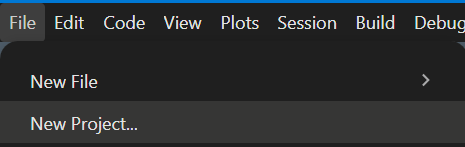
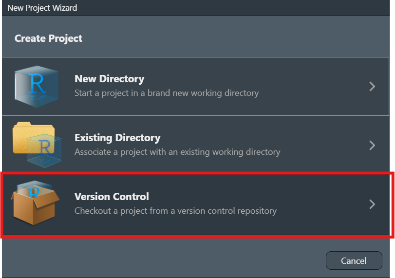
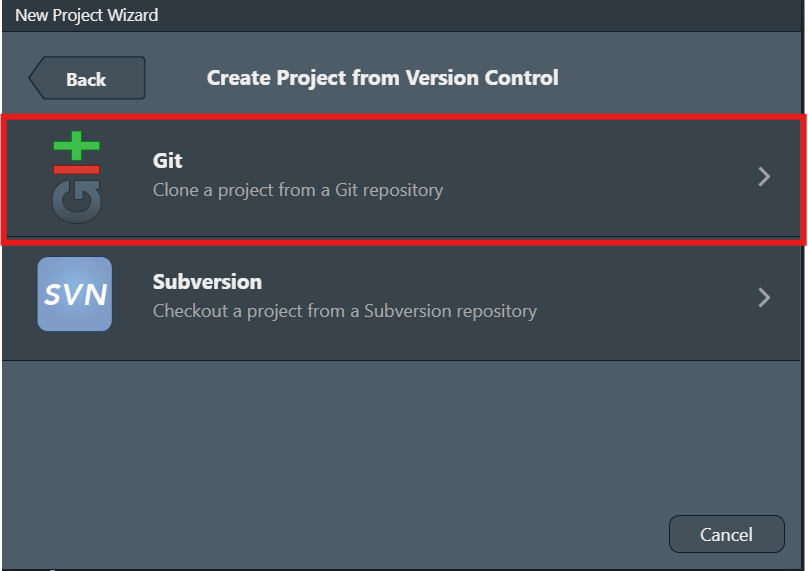
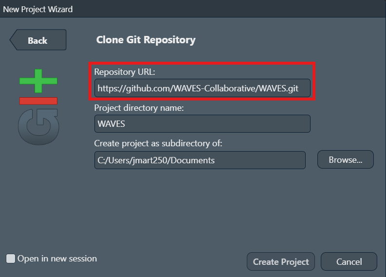

# Introduction to WAVES

## Preliminary Setup

For the following steps, administrator access should not be needed.

1.  Install R

    1.  From this [CRAN mirrors
        webpage](https://cran.r-project.org/mirrors.html), click on the
        mirror from the location closest to you.

    2.  On the following page, download and install R for your operating
        system. So far, only Windows and macOS have been tested.

    3.  The code has been tested on v4.4.1 and v4.5.2. We recommend the
        latest v4.5.2. but earlier versions down to 4.4.0 should work.
        Just note you will get warning messages that the packages were
        developed for 4.5.2.

2.  Install RStudio

    1.  From this [POSIT RStudio
        webpage](https://posit.co/download/rstudio-desktop/), click on
        the “DOWNLOAD RSTUDIO DESKTOP FOR WINDOWS/MACOS”
    2.  A version from 2023 onwards should be okay.

3.  Install compilation tools (platform-specific)

    **Windows:**

    1.  From the [CRAN RTools
        webpage](https://cran.r-project.org/bin/windows/Rtools/),
        download the RTools version specific to the R version being used
        (i.e. Rtools 4.4 for R v4.4.1, RTools 4.5 for R v4.5.2)

    **macOS:**

    Several R packages need to be compiled from source. Install the
    following dependencies via [Homebrew](https://brew.sh/) by running
    the following command within the system shell (Terminal):

        brew install cmake gcc gettext

    Then create `~/.R/Makevars` so R can find the installed libraries by
    running the following code within the system shell (Terminal):

        mkdir -p ~/.R
        cat > ~/.R/Makevars << 'EOF'
        CPPFLAGS += -I/opt/homebrew/opt/gettext/include
        LDFLAGS += -L/opt/homebrew/opt/gettext/lib -lintl -L/opt/homebrew/opt/gcc/lib/gcc/current
        FLIBS = -L/opt/homebrew/opt/gcc/lib/gcc/current -lgfortran -lquadmath
        FC = /opt/homebrew/bin/gfortran
        F77 = /opt/homebrew/bin/gfortran
        EOF

    Additionally, the `arrow` R package requires setting an environment
    variable before running
    [`renv::restore()`](https://rstudio.github.io/renv/reference/restore.html).
    Run the following within the system shell (Terminal):

        export LIBARROW_BINARY=true

    This tells the package to download a pre-built Arrow C++ library
    instead of compiling against the system version.

4.  Install Git by going to [git install
    webpage](https://git-scm.com/install/). There, select your operating
    system and follow the instructions on the webpage.

    1.  In the git setup wizard, select all the default options.

5.  Open the RStudio application. In the Navigation bar at the top left
    corner, click File -\> New Project…

    

6.  In the New Project wizard pop-up, click “Version Control”.

    

7.  Then, click “Git”.

    

8.  Go to the WAVES github page, Click on the green “Code” button, and
    click the “Copy to Clipboard” button.

    

9.  Go back to the RStudio New Project pop-up and paste the WAVES Github
    link in the Repository URL section. The “Project directory name”
    will automatically appear as WAVES.

    

10. Choose location of WAVES repository in the “Create project as
    subdirectory of” section.

    1.  The location of the WAVES repository can generally be downloaded
        anywhere on your system. However, it is ***HIGHLY*** recommended
        to:
        1.  Download the repository on a mapped network drive or on the
            actual computer system itself, ***NOT*** on the cloud such
            as OneDrive.
        2.  Not save it directly under a directory with the following
            names: `bash`, `data`, `logs`, `media`, `models`, `quarto`,
            `R`, `renv` or `reports.`
        3.  Keep it on the same drive where the raw accelerometer data
            is located.

11. Click the “Create Project” button.

You are now ready to start running the configuration pipeline! See
[`vignette("instructions-config")`](https://waves-collaborative.github.io/WAVES/articles/instructions-config.md)
to continue.

## Notes

- Even if a pipeline finishes successfully, you may see in the console
  “There were XX warnings (use warnings() to see them)”. This is normal
  if working on an R version that is not 4.5.2., as the messages will be
  warnings that the packages are meant to work on the latest R version.
  As long as the R version being used is R 4.4 or beyond, everything
  should still work. We have not tested the WAVES repository on R
  versions below 4.4.

- If working on a high performance cluster…TODO (work with Hayden, Ben
  on swarm and batch scripts)

- If the pipeline appears “stuck” after 24hrs, as in it looks like there
  has been no change in the processing time or the console messages have
  been the same for quite awhile, its most likely that your computer
  does not have enough computing resources to do parallel processing. In
  that case:

  - Stop the pipeline by clicking the “STOP” button that appears in the
    top right corner of the Console pane.

  

  - Change the `n_workers` object to 2. If `n_workers` is already set to
    2, then please run the WAVES repository on a computer system with
    better specifications, or reach out to the WAVES team for further
    discussion.

- **Resetting conda environments:** Once the WAVES repository has been
  installed, major version changes to the pipeline may result in prior
  conda environment installations to be outdated. Unfortunately,
  re-running the configuration pipeline by itself may not be sufficient,
  which will require removing the existing environments entirely before
  rerunning the configuration pipeline. To do so, first run the code
  within the INPUT section of `_targets_config.R`. Then, run the
  following code within the R console:

      library(reticulate)
      conda_remove("WHO_WAVES_stepcount")
      conda_remove("WHO_WAVES_accelerometer")
      conda_remove("WHO_WAVES_actinet")
      conda_remove("WHO_WAVES_oak_1.0")
      conda_remove("WHO_WAVES_oak_pre")

  After removal, re-run the config pipeline (`tar_make()`) and it will
  recreate the missing environments.

## Posting an Issue on GitHub

After navigating to the Issues tab of WAVES, please use the following
naming convention for the title of the issue:

    [Pipeline] - [Target/Report] - [Quick Description]

where:

- Pipeline: `Config` or `Main`

  - If the error occurred while running the `Config` pipeline or `Main`
    pipeline.

- Target/Report: any of the targets within a pipeline or a report such
  as `summary_pipeline_main` or `summary_miniconda`

  - A “target” is another name for a step within the pipeline.

  - The target that errored is usually what appears after an ❌. So in
    Step 7 of the Configuration pipeline instructions, the target was
    `fpa_merged`

  - The following is a list of targets within the pipelines where errors
    may occur:

    - vct_raw

    - vct_raw_type

    - vct_basic

    - lst_out.cut

    - vct_ox_input

    - vct_ox_step

    - vct_ox_wlms

    - vct_ox_acti

    - lst_ox

    - vct_cal

    - lst_out.raw

    - lst_out.oak.pre

    - fpa_merged

    - pipeline_summary

  - The below only appear within the `config` pipeline:

    - lst_miniconda

    - minconda_summary

- Quick Description: The error itself if it is ≤ 10 words or a summary

Within the description of the issue, please either:

- screenshot your console that includes the pipeline output and the
  error itself (example below)

- Copy the output from the console into a codeblock

  - With the description box highlighted, enter a forward slash `/` and
    then select “Code Block”

  

  - For language, select “R”

  - Within the code block, paste the console output

Additionally, if the error occured at `lst_out.raw` , `vct_ox_step` ,
`vct_ox_wlms` , `vct_ox_acti` `lst_out.raw` or `lst_out.oak.pre` , then
please also attach the “summary_miniconda.html” report.
