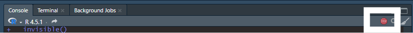

# Running the Main Pipeline

## Previous Step

Please make sure you have defined site-specific parameters within your
YAML file as defined in
[`vignette("instructions-yaml")`](https://waves-collaborative.github.io/WAVES/articles/instructions-yaml.md)
before proceeding.

## Main Pipeline

1.  Open “\_targets.R”

    1.  Navigate to the “Files” tab within Rstudio (located either in
        the bottom left or top left pane of the RStudio window IF you
        haven’t changed the pane layout in “Global Settings”). Click on
        “\_targets.R”

    2.  Alternatively, open “\_targets.R” with the system File Explorer.
        It should open the script within RStudio.

2.  Within “INPUT” section, check the following:

    1.  `RETICULATE_MINICONDA_PATH`: The path to the conda installation
        specified within the configuration pipeline.
    2.  Check the object `trial_run` is set to `TRUE`. This will run one
        of your raw wrist accelerometer files through the pipeline as
        one last precaution to:
        1.  Ensure one of your raw wrist accelerometer files can safely
            go through the pipeline.
        2.  **NOTE**: All reference files will still go through the
            pipeline as it is not as computationaly demanding to have
            your reference files go through the pipeline.
    3.  `n_workers`: The default is 2 workers, meaning 2 processes of
        the pipeline will run in parallel of each other.
        1.  `n_workers` should always be at least 2!
        2.  If your operating system has more RAM and cores available,
            feel free to increase the number of workers, with the max
            being one less than the number of cores available of your
            system (`future::availableCores() - 1`)

3.  Save the “\_targets.R” script.

4.  Run the code within “INPUT” section.

5.  In Console, run “tar_make()”. For one file that is a whole day, it
    can take anywhere between 15-30 minutes on a potato computer. For
    one file that is a whole week, it may take up to 24 hours.

6.  Once the pipeline has completed, a .html file should have been
    created under the “reports” folder called
    “summary_pipeline_main.html”. Open the file and double-check the
    file went through entire pipeline successfully under the “By Major
    Steps” section.

7.  If pipeline works successfully, close the
    “summary_pipeline_main.html” file and run pipeline on all files
    available by setting `trial_run` to `FALSE`.

    1.  Make sure to save the “\_targets.R” script and rerun the code
        within “INPUT” section.

    2.  This WILL take awhile, if not multiple days if the repository is
        not being ran on a high performance cluster.

    3.  If the repository is being ran on a local computer, it is almost
        mandatory that no other work be done while the pipeline is
        running.

        1.  If the pipeline is interrupted due to an unexpected restart,
            the progress should be saved for major steps within the
            pipeline. Re-follow steps 4-5 and the pipeline will pick up
            from the last major step.

8.  Open “summary_pipeline_main.html” once again and check to see what
    files have made it through. If all files have made it through, or at
    least the file’s you would’ve expected to be successfully processed,
    share the “3_MERGED” folder with WAVES data team, where files within
    “3_MERGED” will already be renamed with the WAVES-specific ID.

## Notes

- Even if a pipeline finishes successfully, you may see in the console
  “There were XX warnings (use warnings() to see them)”. This is normal
  if working on an R version that is not 4.5.2., as the messages will be
  warnings that the packages are meant to work on the latest R version.
  As long as the R version being used is R 4.4 or beyond, everything
  should still work. We have not tested the WAVES repository on R
  versions below 4.4.

- If working on a high performance cluster…TODO (work with Hayden, Ben
  on swarm and batch scripts)

- If the pipeline appears “stuck” after 24hrs, as in it looks like there
  has been no change in the processing time or the console messages have
  been the same for quite awhile, its most likely that your computer
  does not have enough computing resources to do parallel processing. In
  that case:

  - Stop the pipeline by clicking the “STOP” button that appears in the
    top right corner of the Console pane.

  

  - Change the `n_workers` object to 2. If `n_workers` is already set to
    2, then please run the WAVES repository on a computer system with
    better specifications, or reach out to the WAVES team for further
    discussion.
