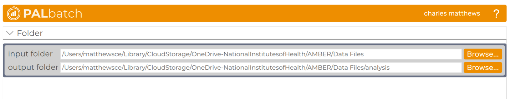
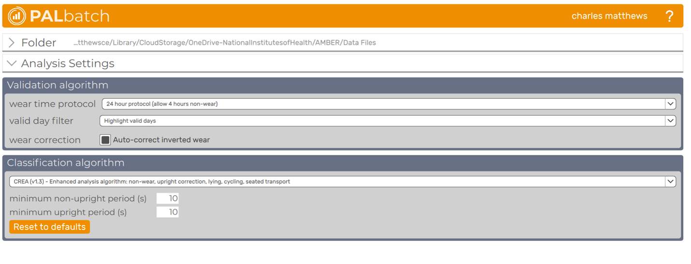
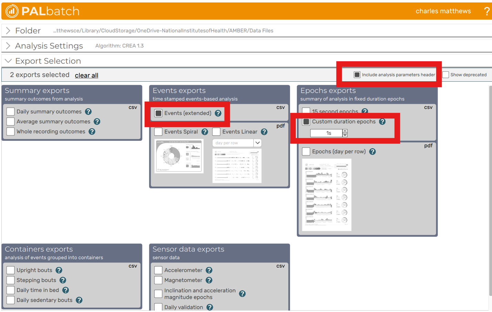

# Reference Data Codebook

**Purpose**: Describe the variables for meta data and ground truth
format for studies contributing data to the WAVES analysis. Designed to
align with analysis plan below.

Of note, the expectation is for WAVES studies to map their existing
labeled data to this codebook, or process their reference data following
instructions listed here, where possible. The expectation is not to
relabel data for this analysis. In the excel appendix, studies should
provide their labels, operational definitions and mappings.

## Analysis Plan - Aim 1

Performance evaluation of three core metrics (sedentary time, step
counting, moderate-vigorous physical activity) compared to a primary
reference measure video recorded direct observation collected for a
fixed amount of time, at least 1-hour hours within a free-living
environment (i.e., naturalistic conditions, not laboratory or scripted).

Identify primary outcome of interest and propose a priori sensitivity
analyses to examine accuracy across different domains and movement that
are important for public health and/or may have a unique movement signal
that should be considered.

1.  Sedentary TIme
    1.  **\*Total sedentary time**: Comparison of algorithms and
        ground-truth across all labeled data in final datasets.
    2.  **Broad domain**: Stratified by 5-class consistent with GPAQ
        where possible (household, occupation, travel, leisure, other)
    3.  **Sedentary types**: Stratified by 4-class: non-sedentary,
        sitting/reclining, lying, sedentary driving.
2.  Step Counting
    1.  **\*Total steps**: Comparison of algorithms and ground-truth
        across all labeled data in final datasets.
    2.  **Broad domain**: Stratified by 5-class consistent with GPAQ
        where possible (household, occupation, travel, leisure, other).
    3.  **Whole-body movement**: Stratified by 5-class (sedentary, mixed
        movement, walking, running, biking).
3.  Moderate-vigorous physical activity (MVPA)
    1.  **\*Total MVPA**: Comparison of algorithms and ground-truth
        across all labeled data in final datasets.
    2.  **Broad domain**: Stratified by 5-class consistent with GPAQ
        where possible (household, occupation, travel, leisure, other)
    3.  **Whole-body movement**: Stratified by 5-class (sedentary, mixed
        movement, walking, running, biking).

*\*Indicates primary analysis*

## Analysis Plan – Aim 2

Performance evaluation of three core metrics (sedentary time, step
counting, MVPA) compared to a field-based secondary reference measure
collected over one or more 24-hour periods in free-living conditions.

**Study Requirements**:

- Protocol that includes minimum of 16-hour wear protocol for wrist worn
  device and field-based reference measure.

- Simultaneous raw wrist-worn device AND a reference measure traceable
  to a primary reference method with acceptable accuracy and precision
  in field-based testing

## Metadata

Notes:

- • Variables indicated as **required** must be included for a study’s
  data to be used in this analysis.

### Data Dictionary

[TABLE]

### Example

| study | subject | age | bmi  | gender | device | sampling | location |
|-------|---------|-----|------|--------|--------|----------|----------|
| ACT24 | 101     | 21  | 23.4 | F      | AG3X   | 30       | non_dom  |

## Video-Recorded Direct Observation

Notes:

- Reference measure for sedentary time, step counts and MVPA.

- Row unit: one record per 1-second epoch of direct observation.

- Variables listed as required must be provided for the study’s data to
  be included in the analysis.

&nbsp;

- intensity3_do and intensity4_do are MET-based classifications and
  should be internally consistent:

  - “mvpa” in intensity3_do corresponds to “moderate” or “vigorous” in
    intensity4_do.

- Sedtype_do provides a sedentary subtype classification and should
  align with:

  - posture_do = “sedentary”

  - intensity_do = “sedentary”

  - “non-sed” in Sedtype_do corresponds to all non-sedentary
    posture/intensity combinations.

- A study must have sedentary time, MVPA or steps labeled in a way
  consistent with operational definitions to be included in the
  analysis.

- The study does not need to have all three outcomes to be included. If
  an outcome is missing, the variable should still be included with
  either NAs or left completely empty.

### Data Dictionary

[TABLE]

### Example

| study | subject | observation | datetime | date | time | domain_do | posture_do | sedtype_do | intensity3_do | intensity4_do | steps_do |
|----|----|----|----|----|----|----|----|----|----|----|----|
| ACT24 | 101 | 1 | 1990-01-01T18:36:10Z | 1990-01-01 | 10:36:10 | transportation | walking | non_sed | mvpa | moderate | 2 |

## Wearable Camera Still-Images

Notes:

- Reference measure for sedentary time and MVPA(?).

- Row unit: one record per 1-second epoch .

- Variables listed as required must be provided for the study’s data to
  be included in the analysis.

&nbsp;

- intensity3_do and intensity4_do are MET-based classifications and
  should be internally consistent:

  - “mvpa” in intensity3_do corresponds to “moderate” or “vigorous” in
    intensity4_do.

- Sedtype_do provides a sedentary subtype classification and should
  align with:

  - posture_do = “sedentary”

  - intensity_do = “sedentary”

  - “non-sed” in Sedtype_do corresponds to all non-sedentary
    posture/intensity combinations.

- A study must have sedentary time, MVPA or steps labeled in a way
  consistent with operational definitions to be included in the
  analysis.

- The study does not need to have all three outcomes to be included. If
  an outcome is missing, the variable should still be included with
  either NAs or left completely empty.

### Data Dictionary

[TABLE]

### Example

| study | subject | observation | datetime | date | time | domain_do | posture_do | sedtype_do | intensity3_do | intensity4_do | steps_do |
|----|----|----|----|----|----|----|----|----|----|----|----|
| ACT24 | 101 | 1 | 1990-01-01T18:36:10Z | 1990-01-01 | 10:36:10 | transportation | walking | non_sed | mvpa | moderate | 2 |

## Thigh-worn activPAL

The following instructions are to create the EventsEx and 1-second epoch
exports from PALBatch software If participants were instructed to wear a
thigh-worn activPAL for your study.

1.  Open PALbatch. Update to the most recent version if available

    1.  At the time of writing (March 20, 2026), this would be PALbatch
        v8.11.1.63

2.  Within the main window, select your desired input/output folders.
    Ideally, the output folder should be in the same drive as where you
    download the WAVES repository.

3.  Ensure the Analysis Settings are the following:

| Section | Option | Value |
|----|----|----|
| Validation algorithm | wear time protocol | 24 hour protocol (allow 4 hours non-wear) |
|  | valid day filter | Highlight valid days |
|  | wear correction | TRUE |
| Classification algorithm | [CREA](https://kb.palt.com/articles/crea/) (v1.3) |  |
|  | minimum non-upright period (s) | 10 |
|  | minimum upright period (s) | 10 |

4.  Next, expand the Export Selection settings and check the following
    options:

| Section        | Option                             | Value |
|----------------|------------------------------------|-------|
| \-             | include analysis parameters header | TRUE  |
| Events Exports | Events (extended)                  | TRUE  |
| Epochs Exports | Custom duration epochs             | TRUE  |
|                | custom duration                    | 1s    |

5.  Click “Export”

## Other
