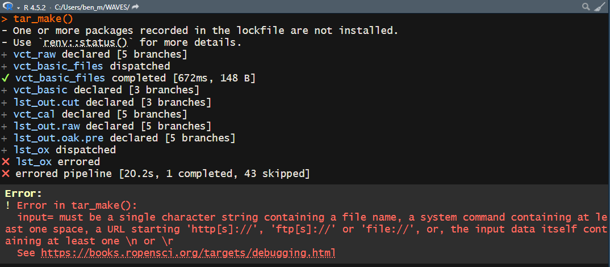

# WAVES

Thank you for your collaboration in the Wrist Algorithm Verification and
Evaluation Study (WAVES). This repository contains all the code needed
to run multiple wrist algorithms against your raw data.

## Proposed Flow Diagram

The proposed flow diagram outlines the process for how the validation
data and data pipeline will work with the WAVES team and groups who have
potentially available validation data.


Flow Diagram

**Full description of the flow diagram coming soon** \## Setup

1.  Install R

    1.  From [this link](https://cran.r-project.org/mirrors.html), click
        on the mirror from the location closest to you.

    2.  On the following page, download and install R for your operating
        system. So far, only Windows and macOS have been tested.

    3.  The code has been tested on v4.4.1 and v4.5.2. We recommend the
        latest v4.5.2. but earlier versions down to 4.4.0 should work.
        Just note you will get warning messages that the packages were
        developed for 4.5.2.

2.  Install RStudio

    1.  From [this link](https://posit.co/download/rstudio-desktop/),
        click on the “DOWNLOAD RSTUDIO DESKTOP FOR WINDOWS/MACOS”
    2.  A version from 2023 onwards should be okay.

3.  Install compilation tools (platform-specific)

    **Windows:**

    1.  From [this
        link](https://cran.r-project.org/bin/windows/Rtools/), download
        the RTools version specific to the R version being used
        (i.e. Rtools 4.4 for R v4.4.1, RTools 4.5 for R v4.5.2)

    **macOS:**

    Several R packages need to be compiled from source. Install the
    following dependencies via [Homebrew](https://brew.sh/) by running
    the following command within the system shell (Terminal):

    ``` R
    brew install cmake gcc gettext
    ```

    Then create `~/.R/Makevars` so R can find the installed libraries by
    running the following code within the system shell (Terminal):

    ``` R
    mkdir -p ~/.R
    cat > ~/.R/Makevars << 'EOF'
    CPPFLAGS += -I/opt/homebrew/opt/gettext/include
    LDFLAGS += -L/opt/homebrew/opt/gettext/lib -lintl -L/opt/homebrew/opt/gcc/lib/gcc/current
    FLIBS = -L/opt/homebrew/opt/gcc/lib/gcc/current -lgfortran -lquadmath
    FC = /opt/homebrew/bin/gfortran
    F77 = /opt/homebrew/bin/gfortran
    EOF
    ```

    Additionally, the `arrow` R package requires setting an environment
    variable before running
    [`renv::restore()`](https://rstudio.github.io/renv/reference/restore.html).
    Run the following within the system shell (Terminal):

    ``` R
    export LIBARROW_BINARY=true
    ```

    This tells the package to download a pre-built Arrow C++ library
    instead of compiling against the system version.

4.  Download WAVES repository.

    1.  The location of the WAVES repository can be downloaded anywhere
        on your system, but it is generally recommended to keep it on
        the same drive of the raw accelerometer data.

## Instructions

### Configuration Pipeline

1.  Open WAVES.RProj

    1.  This will automatically open the RStudio IDE.

2.  In Console, run
    [`renv::restore()`](https://rstudio.github.io/renv/reference/restore.html)

    1.  This command will download all the R software packages needed
        for the WAVES repository. It will take a while.

3.  Open “\_targets_config.R”

    1.  Navigate to the “Files” tab within Rstudio (located either in
        the bottom left or top left pane of the RStudio window IF you
        haven’t changed the pane layout in “Global Settings”). Click on
        “\_targets*\_*config.R”

    2.  Alternatively, open “\_targets*\_*config.R” with the system File
        Explorer. It should open the script within RStudio.

4.  Within “INPUT” section, check the following:

    1.  `RETICULATE_MINICONDA_PATH`: The path to an existing conda
        installation or where you want a new minconda distribution to be
        installed.
        1.  If this is changed, please ensure there are no spaces within
            the file path
        2.  Note that if the WAVES directory is located under another
            directory with the names `bash`, `data`, `logs`, `media`,
            `models`, `quarto`, `R`, `renv` or `reports`, the config
            pipeline will install miniconda underneath the corresponding
            folder *in the WAVES directory*.
            1.  For example, if the WAVES directory was installed under
                “/data/martinez/”, then miniconda will be installed in
                “/data/martinez/WAVES/data/martinez/r-miniconda”
    2.  `n_workers`: The default is 2 workers, meaning 2 processes of
        the pipeline will run in parallel of each other.
        1.  `n_workers` should always be at least 2!
        2.  If your operating system has more RAM and cores available,
            feel free to increase the number of workers, with the max
            being one less than the number of cores available of your
            system (`future::availableCores() - 1`)

5.  Run all code within the “INPUT” section (Line 8 - Line 26) and save
    the script.

6.  In Console, run `tar_make().`The “configuration” pipeline is now
    running, which will print messages out in the Console like the below
    image.

    

    The “configuration” pipeline is:

    1.  Downloading and installing non-R software

    2.  Running the code against “configuration” data included within
        the WAVES repository to ensure code is running properly

    3.  This will take awhile! On a potato computer, it took 15-24
        hours!

    4.  If the repository is being ran on a local computer, it is almost
        mandatory that no other work be done while the pipeline is
        running.

7.  Once the pipeline is complete the console should say “ended
    pipeline” with how long it took.

    

    Or it may error like so:

    

    At least `config_miniconda` should be completed, allowing you to
    move on to step 8.

8.  A “summary_miniconda.html” will have been created under the
    “reports” folder of the main WAVES repository. Within the html file:

    1.  Check Miniconda configuration is good, where status is not
        “Unsuccessful installation”.

    2.  No packages/modules are highlighted red for each environment.

        1.  For a environment, the Modules message may say “Modules
            installated do not completely match WAVES configuration”.
            This is expected with slight changes in package/module
            versions within each environment, and are highlighted
            yellow. This shouldn’t impact pipeline processes or
            computations, but are still noted to assist with diagnosing
            potential problems.

9.  If the config pipeline errored, please post on issue on Github
    following the convention set forth under [Posting an Issue on
    GitHub](#posting-an-issue-on-github) section of the README.

10. If the pipeline successfully completed, a
    “summary_pipeline_config.html” file will have been created under the
    “reports” folder of the main WAVES repository. Open the file and
    follow the directions stated within the report.

11. If the “summary_pipeline_config.html” indicates no warnings or
    errors, then the WAVES code is working properly on your computer!
    Woo.

12. If the “summary_pipeline_config” report is red for any reason,
    please post the issue with the title as “Config - Summary Report -
    \[Quick Description\]” with the html attached to the issue.

### Main Pipeline

1.  Open “\_targets.R”

    1.  Navigate to the “Files” tab within Rstudio (located either in
        the bottom left or top left pane of the RStudio window IF you
        haven’t changed the pane layout in “Global Settings”). Click on
        “\_targets.R”

    2.  Alternatively, open “\_targets.R” with the system File Explorer.
        It should open the script within RStudio.

2.  Within “INPUT” section, check the following:

    1.  `RETICULATE_MINICONDA_PATH`: The path to the conda installation
        specified within the configuration pipeline.
    2.  `study_timezone`: Change from
        [`Sys.timezone()`](https://rdrr.io/r/base/timezones.html) if
        data was collected in another timezone. Supply it as
        country/city (e.g. `America/Los Angeles`, `Europe/London`, etc.)
    3.  `sampling_frequency`: The sampling frequency set for
        accelerometers during data collection. If using .bin/.cwa/.gt3x
        data then this doesn’t matter, but does for .csv data.
    4.  `n_workers`: The default is 2 workers, meaning 2 processes of
        the pipeline will run in parallel of each other.
        1.  `n_workers` should always be at least 2!
        2.  If your operating system has more RAM and cores available,
            feel free to increase the number of workers, with the max
            being one less than the number of cores available of your
            system (`future::availableCores() - 1`)
    5.  `vct_raw_fpa`: Change vct_raw_fpa such that it creates a
        character vector that points towards your raw files.
        1.  We provide an example of how to do so using the `list.files`
            function, where the `file.path` function is used to list
            multiple directories at once.
        2.  We suggest putting a “\[1\]” at the end of `list.files` to
            make sure pipeline works with one file. (image below)

    

3.  Save the “\_targets.R” script.

4.  Run the code within “INPUT” section.

5.  In Console, run “tar_make()”. For one file that is a whole day, it
    can take anywhere between 15-30 minutes on a potato computer. For
    one file that is a whole week, it may take up to 24 hours.

6.  Once the pipeline has completed, a .html file should have been
    created under the “reports” folder called
    “summary_pipeline_main.html”. Open the file and double-check file
    went through entire pipeline successfully under the “By Major Steps”
    section.

7.  If pipeline works successfully, close the
    “summary_pipeline_main.html” file and run pipeline on all files
    available by removing the the “\[1\]” at the end of the `list.files`
    function.

    1.  Make sure to save the “\_targets.R” script and rerun the code
        within “INPUT” section.

    2.  This WILL take multiple days if the repository is not being ran
        on a high performance cluster.

    3.  If the repository is being ran on a local computer, it is almost
        mandatory that no other work be done while the pipeline is
        running.

        1.  If the pipeline is interrupted due to an unexpected restart,
            the progress should be saved for major steps within the
            pipeline. Re-follow steps 12-13 the pipeline will pick up
            from the last major step.

8.  Open “summary_pipeline_main.html” once again and check to see what
    files have made it through. If all files have made it through, or at
    least the file’s you would’ve expected to be successfully processed,
    share the “3_MERGED” folder with WAVES data team, where “3_MERGED”
    is renamed with the study acronym.

## Notes

- Even if a pipeline finishes successfully, you may see in the console
  “There were XX warnings (use warnings() to see them)”. This is normal
  if working on an R version that is not 4.5.2., as the messages will be
  warnings that the packages are meant to work on the latest R version.
  As long as the R version being used is R 4.4 or beyond, everything
  should still work. We have not tested the WAVES repository on R
  versions below 4.4.

- If working on a high performance cluster…TODO (work with Hayden, Ben
  on swarm and batch scripts)

- If the pipeline appears “stuck” after 24hrs, as in it looks like there
  has been no change in the processing time or the console messages have
  been the same for quite awhile, its most likely that your computer
  does not have enough computing resources to do parallel processing. In
  that case:

  - Stop the pipeline by clicking the “STOP” button that appears in the
    top right corner of the Console pane.

  

  - Change the `n_workers` object to 1, which will remove parallel
    processing.

- **Resetting conda environments:** Once the WAVES repository has been
  installed, major version changes to the pipeline may result in prior
  conda environment installations to be outdated. Unfortunately,
  re-running the configuration pipeline by itself may not be sufficient,
  which will require removing the existing environments entirely before
  rerunning the configuration pipeline. To do so, first run the code
  within the INPUT section of `_targets_config.R`. Then, run the
  following code within the R console:

  ``` R
  library(reticulate)
  conda_remove("WHO_WAVES_stepcount")
  conda_remove("WHO_WAVES_accelerometer")
  conda_remove("WHO_WAVES_actinet")
  conda_remove("WHO_WAVES_oak_1.0")
  conda_remove("WHO_WAVES_oak_pre")
  ```

  After removal, re-run the config pipeline (`tar_make()`) and it will
  recreate the missing environments.

## Posting an Issue on GitHub

After navigating to the Issues tab of WAVES, please use the following
naming convention for the title of the issue:

``` R
[Pipeline] - [Target/Report] - [Quick Description]
```

where:

- Pipeline: `Config` or `Main`

  - If the error occurred while running the `Config` pipeline or `Main`
    pipeline.

- Target/Report: any of the targets within a pipeline or a report such
  as `summary_pipeline_main` or `summary_miniconda`

  - A “target” is another name for a step within the pipeline.

  - The target that errored is usually what appears after an ❌. So in
    Step 7 of the Configuration pipeline instructions, the target was
    `fpa_merged`

  - The following is a list of targets within the pipelines where errors
    may occur:

    - vct_raw

    - vct_raw_type

    - vct_basic

    - lst_out.cut

    - vct_ox_input

    - vct_ox_step

    - vct_ox_wlms

    - vct_ox_acti

    - lst_ox

    - vct_cal

    - lst_out.raw

    - lst_out.oak.pre

    - fpa_merged

    - pipeline_summary

  - The below only appear within the `config` pipeline:

    - lst_miniconda

    - minconda_summary

- Quick Description: The error itself if it is ≤ 10 words or a summary

Within the description of the issue, please either:

- screenshot your console that includes the pipeline output and the
  error itself (example below)



- Copy the output from the console into a codeblock

  - With the description box highlighted, enter a forward slash `/` and
    then select “Code Block”

  

  - For language, select “R”

  - Within the code block, paste the console output

Additionally, if the error occured at `lst_out.raw` , `vct_ox_step` ,
`vct_ox_wlms` , `vct_ox_acti` `lst_out.raw` or `lst_out.oak.pre` , then
please also attach the “summary_miniconda.html” report.

## Methods Implemented

| Method                                   | MVPA | SED | Steps |
|------------------------------------------|------|-----|-------|
| Bakrania 2016¹                           | ❌   | ✔️  | ❌    |
| Ellis 2016² Extended                     | ✔️️   | ✔️  | ❌    |
| Esliger 2011³                            | ✔️   | ✔️  | ❌    |
| Fraysse 2020⁴                            | ✔️   | ✔️  | ❌    |
| Hildebrand 2014⁵/2017⁶                   | ✔️   | ✔️  | ❌    |
| Mielke 2023⁷                             | ✔️   | ✔️  | ❌    |
| Montoye 2018⁸                            | ✔️   | ✔️  | ❌    |
| Trost 2017⁹ Extended                     | ✔️   | ✔️  | ❌    |
| Walmsley 2022¹⁰ (accelerometer v7.3.0¹¹) | ✔️   | ✔️  | ❌    |
| White 2016¹² ENMO and HPFVM              | ✔️   | ✔️  | ❌    |
| Yuan 2024¹³ (actinet)                    | ✔️   | ✔️  | ❌    |
| Oak¹⁴                                    | ❌   | ❌  | ✔️    |
| Small 2024¹⁵ (stepcount v3.17.1¹⁶)       | ❌   | ❌  | ✔️    |
| Step Detection Threshold¹⁷ (SDT)         | ❌   | ❌  | ✔️    |
| Verisense (Original)¹⁸                   | ❌   | ❌  | ✔️    |
| Verisense (Revised)¹⁹                    | ❌   | ❌  | ✔️    |

## TODO

- Test WAVES_10006 CSV file against OxWearable methods.

  - Stepcount
  - Walmsley
  - Actinet

## References for Methods

1\.

Bakrania K, Yates T, Rowlands AV, et al. [Intensity Thresholds on Raw
Acceleration Data: Euclidean Norm Minus One (ENMO) and Mean Amplitude
Deviation (MAD)
Approaches](https://doi.org/10.1371/journal.pone.0164045). *PLOS ONE*
2016; 11: e0164045.

2\.

Ellis K, Kerr J, Godbole S, et al. [Hip and wrist accelerometer
algorithms for free-living behavior
classification](https://doi.org/10.1249/MSS.0000000000000840). *Medicine
& Science in Sports & Exercise* 2016; 48: 933–940.

3\.

Esliger DW, Rowlands AV, Hurst TL, et al. [Validation of the GENEA
accelerometer](https://doi.org/10.1249/MSS.0b013e31820513be). *Medicine
& Science in Sports & Exercise* 2011; 43: 1085.

4\.

Fraysse F, Post D, Eston R, et al. Physical activity intensity
cut-points for wrist-worn GENEActiv in older adults. *Frontiers in
Sports and Active Living*; 2. Epub ahead of print 15 January 2021. DOI:
[10.3389/fspor.2020.579278](https://doi.org/10.3389/fspor.2020.579278).

5\.

Hildebrand M, Van Hees VT, Hansen BH, et al. [Age group comparability of
raw accelerometer output from wrist- and hip-worn
monitors](https://doi.org/10.1249/MSS.0000000000000289). *Medicine &
Science in Sports & Exercise* 2014; 46: 1816.

6\.

Hildebrand M, Hansen BH, Hees VT van, et al. [Evaluation of raw
acceleration sedentary thresholds in children and
adults](https://doi.org/10.1111/sms.12795). *Scandinavian Journal of
Medicine & Science in Sports* 2017; 27: 1814–1823.

7\.

Mielke GI, Almeida Mendes M de, Ekelund U, et al. [Absolute intensity
thresholds for tri-axial wrist and waist accelerometer-measured movement
behaviors in adults](https://doi.org/10.1111/sms.14416). *Scandinavian
Journal of Medicine & Science in Sports* 2023; 33: 1752–1764.

8\.

Montoye AHK, Westgate BS, Fonley MR, et al. [Cross-validation and
out-of-sample testing of physical activity intensity predictions with a
wrist-worn
accelerometer](https://doi.org/10.1152/japplphysiol.00760.2017).
*Journal of Applied Physiology (Bethesda, Md: 1985)* 2018; 124:
1284–1293.

9\.

Pavey TG, Gilson ND, Gomersall SR, et al. [Field evaluation of a random
forest activity classifier for wrist-worn accelerometer
data](https://doi.org/10.1016/j.jsams.2016.06.003). *Journal of Science
and Medicine in Sport* 2017; 20: 75–80.

10\.

Walmsley R, Chan S, Smith-Byrne K, et al. Reallocation of time between
device-measured movement behaviours and risk of incident cardiovascular
disease. Epub ahead of print 1 September 2022. DOI:
[10.1136/bjsports-2021-104050](https://doi.org/10.1136/bjsports-2021-104050).

11\.

Doherty A, Chan S, Yuan H, et al. *Accelerometer: A python toolkit for
extracting physical activity and behavior metrics from wearable sensor
data*. Zenodo. Epub ahead of print 13 July 2025. DOI:
[10.5281/zenodo.15874476](https://doi.org/10.5281/zenodo.15874476).

12\.

White T, Westgate K, Wareham NJ, et al. [Estimation of Physical Activity
Energy Expenditure during Free-Living from Wrist Accelerometry in UK
Adults](https://doi.org/10.1371/journal.pone.0167472). *PLOS ONE* 2016;
11: e0167472.

13\.

Yuan H, Chan S, Creagh AP, et al. [Self-supervised learning for human
activity recognition using 700,000 person-days of wearable
data](https://doi.org/10.1038/s41746-024-01062-3). *npj Digital
Medicine* 2024; 7: 91.

14\.

Straczkiewicz M, Huang EJ, Onnela J-P. [A “one-size-fits-most” walking
recognition method for smartphones, smartwatches, and wearable
accelerometers](https://doi.org/10.1038/s41746-022-00745-z). *npj
Digital Medicine* 2023; 6: 29.

15\.

Small SR, Chan S, Walmsley R, et al. [Self-supervised machine learning
to characterize step counts from wrist-worn accelerometers in the UK
biobank](https://doi.org/10.1249/MSS.0000000000003478). *Medicine &
Science in Sports & Exercise* 2024; 56: 1945.

16\.

Chan S, Small SR, Acquah A, et al. *Improved step counting via
foundation models for wrist-worn accelerometers*. Zenodo. Epub ahead of
print 15 January 2026. DOI:
[10.5281/zenodo.18255030](https://doi.org/10.5281/zenodo.18255030).

17\.

Ducharme SW, Lim J, Busa MA, et al. A Transparent Method for Step
Detection Using an Acceleration Threshold. Epub ahead of print 25
October 2021. DOI:
[10.1123/jmpb.2021-0011](https://doi.org/10.1123/jmpb.2021-0011).

18\.

Gu F, Khoshelham K, Shang J, et al. [Robust and accurate
smartphone-based step counting for indoor
localization](https://doi.org/10.1109/JSEN.2017.2685999). *IEEE Sensors
Journal* 2017; 17: 3453–3460.

19\.

Maylor BD, Edwardson CL, Dempsey PC, et al. Stepping towards More
Intuitive Physical Activity Metrics with Wrist-Worn Accelerometry:
Validity of an Open-Source Step-Count Algorithm. *Sensors*; 22. Epub
ahead of print 18 December 2022. DOI:
[10.3390/s22249984](https://doi.org/10.3390/s22249984).
