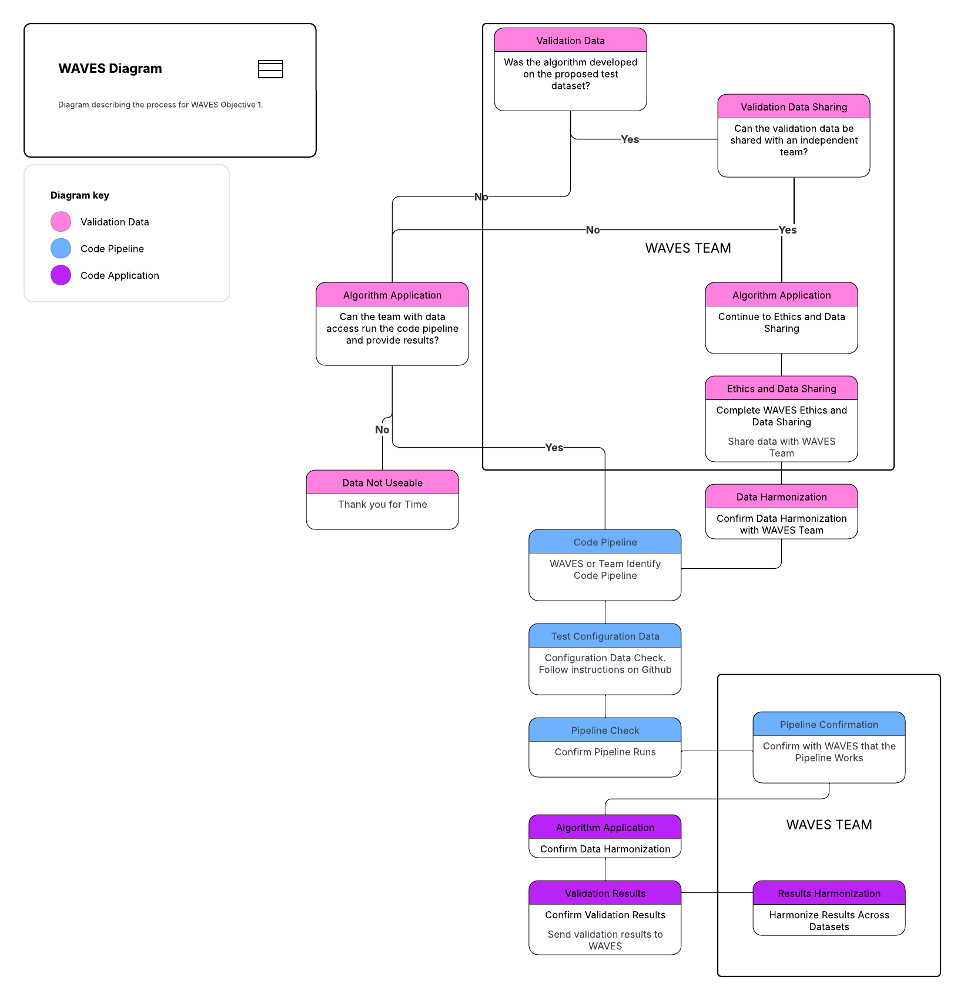

# WAVES

Thank you for your collaboration in the Wrist Algorithm Verification and
Evaluation Study (WAVES). This repository contains all the code needed
to run multiple wrist algorithms against your raw data.

## Proposed Flow Diagram

The proposed flow diagram outlines the process for how the validation
data and data pipeline will work with the WAVES team and groups who have
potentially available validation data.

Flow Diagram

**Full description of the flow diagram coming soon**

## Getting Started

Visit the [Github Pages for
WAVES](https://waves-collaborative.github.io/WAVES/) and click on the
“Get Started” tab.

FIGURE showing the “Get Started” page

## Methods Implemented

| Method                                   | MVPA | SED | Steps |
|------------------------------------------|------|-----|-------|
| Bakrania 2016¹                           | ❌   | ✔️  | ❌    |
| Ellis 2016² Extended                     | ✔️️   | ✔️  | ❌    |
| Esliger 2011³                            | ✔️   | ✔️  | ❌    |
| Fraysse 2020⁴                            | ✔️   | ✔️  | ❌    |
| Hildebrand 2014⁵/2017⁶                   | ✔️   | ✔️  | ❌    |
| Mielke 2023⁷                             | ✔️   | ✔️  | ❌    |
| Montoye 2018⁸                            | ✔️   | ✔️  | ❌    |
| Trost 2017⁹ Extended                     | ✔️   | ✔️  | ❌    |
| Walmsley 2022¹⁰ (accelerometer v7.3.0¹¹) | ✔️   | ✔️  | ❌    |
| White 2016¹² ENMO and HPFVM              | ✔️   | ✔️  | ❌    |
| Yuan 2024¹³ (actinet)                    | ✔️   | ✔️  | ❌    |
| Oak¹⁴                                    | ❌   | ❌  | ✔️    |
| Small 2024¹⁵ (stepcount v3.17.1¹⁶)       | ❌   | ❌  | ✔️    |
| Step Detection Threshold¹⁷ (SDT)         | ❌   | ❌  | ✔️    |
| Verisense (Original)¹⁸                   | ❌   | ❌  | ✔️    |
| Verisense (Revised)¹⁹                    | ❌   | ❌  | ✔️    |

## TODO

- Test WAVES_10006 CSV file against OxWearable methods.

  - Stepcount
  - Walmsley
  - Actinet

## References for Methods

1\.

Bakrania K, Yates T, Rowlands AV, et al. [Intensity thresholds on raw
acceleration data: Euclidean norm minus one (ENMO) and mean amplitude
deviation (MAD)
approaches](https://doi.org/10.1371/journal.pone.0164045). *PLOS ONE*
2016; 11: e0164045.

2\.

Ellis K, Kerr J, Godbole S, et al. [Hip and wrist accelerometer
algorithms for free-living behavior
classification](https://doi.org/10.1249/MSS.0000000000000840). *Medicine
& Science in Sports & Exercise* 2016; 48: 933–940.

3\.

Esliger DW, Rowlands AV, Hurst TL, et al. [Validation of the GENEA
accelerometer](https://doi.org/10.1249/MSS.0b013e31820513be). *Medicine
& Science in Sports & Exercise* 2011; 43: 1085.

4\.

Fraysse F, Post D, Eston R, et al. Physical activity intensity
cut-points for wrist-worn GENEActiv in older adults. *Frontiers in
Sports and Active Living*; 2. Epub ahead of print 15 January 2021. DOI:
[10.3389/fspor.2020.579278](https://doi.org/10.3389/fspor.2020.579278).

5\.

Hildebrand M, Van Hees VT, Hansen BH, et al. [Age group comparability of
raw accelerometer output from wrist- and hip-worn
monitors](https://doi.org/10.1249/MSS.0000000000000289). *Medicine &
Science in Sports & Exercise* 2014; 46: 1816.

6\.

Hildebrand M, Hansen BH, Hees VT van, et al. [Evaluation of raw
acceleration sedentary thresholds in children and
adults](https://doi.org/10.1111/sms.12795). *Scandinavian Journal of
Medicine & Science in Sports* 2017; 27: 1814–1823.

7\.

Mielke GI, Almeida Mendes M de, Ekelund U, et al. [Absolute intensity
thresholds for tri-axial wrist and waist accelerometer-measured movement
behaviors in adults](https://doi.org/10.1111/sms.14416). *Scandinavian
Journal of Medicine & Science in Sports* 2023; 33: 1752–1764.

8\.

Montoye AHK, Westgate BS, Fonley MR, et al. [Cross-validation and
out-of-sample testing of physical activity intensity predictions with a
wrist-worn
accelerometer](https://doi.org/10.1152/japplphysiol.00760.2017).
*Journal of Applied Physiology (Bethesda, Md: 1985)* 2018; 124:
1284–1293.

9\.

Pavey TG, Gilson ND, Gomersall SR, et al. [Field evaluation of a random
forest activity classifier for wrist-worn accelerometer
data](https://doi.org/10.1016/j.jsams.2016.06.003). *Journal of Science
and Medicine in Sport* 2017; 20: 75–80.

10\.

Walmsley R, Chan S, Smith-Byrne K, et al. Reallocation of time between
device-measured movement behaviours and risk of incident cardiovascular
disease. Epub ahead of print 1 September 2022. DOI:
[10.1136/bjsports-2021-104050](https://doi.org/10.1136/bjsports-2021-104050).

11\.

Doherty A, Chan S, Yuan H, et al. *Accelerometer: A python toolkit for
extracting physical activity and behavior metrics from wearable sensor
data*. Zenodo. Epub ahead of print 13 July 2025. DOI:
[10.5281/zenodo.15874476](https://doi.org/10.5281/zenodo.15874476).

12\.

White T, Westgate K, Wareham NJ, et al. [Estimation of physical activity
energy expenditure during free-living from wrist accelerometry in UK
adults](https://doi.org/10.1371/journal.pone.0167472). *PLOS ONE* 2016;
11: e0167472.

13\.

Yuan H, Chan S, Creagh AP, et al. [Self-supervised learning for human
activity recognition using 700,000 person-days of wearable
data](https://doi.org/10.1038/s41746-024-01062-3). *npj Digital
Medicine* 2024; 7: 91.

14\.

Straczkiewicz M, Huang EJ, Onnela J-P. [A “one-size-fits-most” walking
recognition method for smartphones, smartwatches, and wearable
accelerometers](https://doi.org/10.1038/s41746-022-00745-z). *npj
Digital Medicine* 2023; 6: 29.

15\.

Small SR, Chan S, Walmsley R, et al. [Self-supervised machine learning
to characterize step counts from wrist-worn accelerometers in the UK
biobank](https://doi.org/10.1249/MSS.0000000000003478). *Medicine &
Science in Sports & Exercise* 2024; 56: 1945.

16\.

Chan S, Small SR, Acquah A, et al. *Improved step counting via
foundation models for wrist-worn accelerometers*. Zenodo. Epub ahead of
print 15 January 2026. DOI:
[10.5281/zenodo.18255030](https://doi.org/10.5281/zenodo.18255030).

17\.

Ducharme SW, Lim J, Busa MA, et al. A transparent method for step
detection using an acceleration threshold. Epub ahead of print 25
October 2021. DOI:
[10.1123/jmpb.2021-0011](https://doi.org/10.1123/jmpb.2021-0011).

18\.

Gu F, Khoshelham K, Shang J, et al. [Robust and accurate
smartphone-based step counting for indoor
localization](https://doi.org/10.1109/JSEN.2017.2685999). *IEEE Sensors
Journal* 2017; 17: 3453–3460.

19\.

Maylor BD, Edwardson CL, Dempsey PC, et al. Stepping towards more
intuitive physical activity metrics with wrist-worn accelerometry:
Validity of an open-source step-count algorithm. *Sensors*; 22. Epub
ahead of print 18 December 2022. DOI:
[10.3390/s22249984](https://doi.org/10.3390/s22249984).
