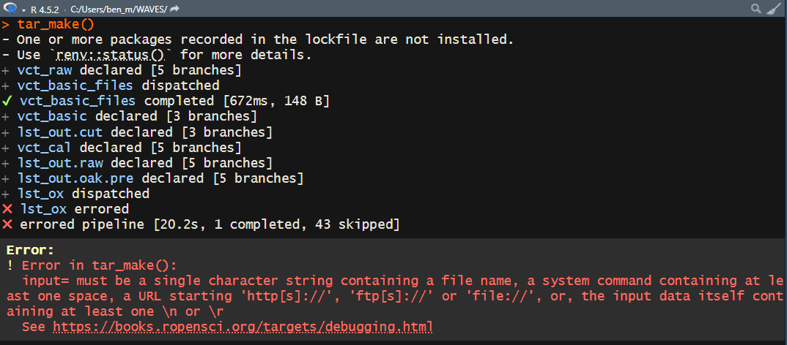
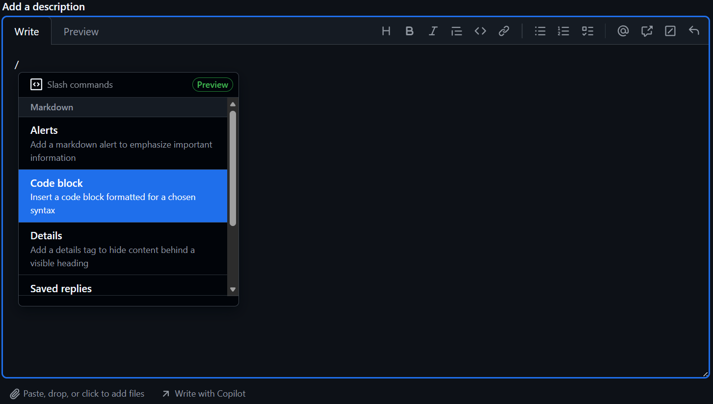

After navigating to the Issues tab of WAVES, please use the following naming convention for the title of the issue:

```         
[Pipeline] - [Target/Report] - [Quick Description]
```

where:

- Pipeline: `Config` or `Main`

  - If the error occurred while running the `Config` pipeline or `Main` pipeline.

- Target/Report: any of the targets within a pipeline or a report such as `summary_pipeline_main` or `summary_miniconda`

  - A "target" is another name for a step within the pipeline.

  - The target that errored is usually what appears after an ❌. So in Step 7 of the Configuration pipeline instructions, the target was `fpa_merged`

  - The following is a list of targets within the pipelines where errors may occur:

    - vct_raw

    - vct_raw_type

    - vct_basic

    - lst_out.cut

    - vct_ox_input

    - vct_ox_step

    - vct_ox_wlms

    - vct_ox_acti

    - lst_ox

    - vct_cal

    - lst_out.raw

    - lst_out.oak.pre

    - fpa_merged

    - pipeline_summary

  - The below only appear within the `config` pipeline:

    - lst_miniconda

    - minconda_summary

- Quick Description: The error itself if it is ≤ 10 words or a summary

Within the description of the issue, please either:

- screenshot your console that includes the pipeline output and the error itself (example below)



- Copy the output from the console into a codeblock

  - With the description box highlighted, enter a forward slash `/` and then select "Code Block"

  

  - For language, select "R"

  - Within the code block, paste the console output

Additionally, if the error occured at `lst_out.raw` , `vct_ox_step` , `vct_ox_wlms` , `vct_ox_acti` `lst_out.raw` or `lst_out.oak.pre` , then please also attach the "summary_miniconda.html" report.
